<!--
  BUTTERFLY.SYS — a small machine that turns caffeine into websites
  ================================================================
  Profile README for @syeda-nimra0 (Nimra Basharat)

  This README is intentionally quiet, cinematic, and personal.
  Live data is generated hourly by .github/workflows/refresh-live-data.yml
  and committed back to ./assets/.

  To customise: see SETUP.md
-->

  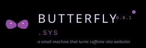

  

 

  <em>studio log · 03:14</em> 
  <em>the butterfly is awake.</em> 
  <strong><em>same girl. bigger dreams.</em></strong>

 

 

<!-- ============================================================= -->
<!-- 01 — WHO'S BEHIND THE KEYBOARD                                -->
<!-- ============================================================= -->

  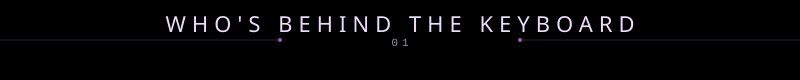

 

  I'm <strong>Nimra Basharat</strong> — a MERN stack developer and a system thinker, 
  building small, fast websites that feel like quiet worlds.

  Based in <strong>Karachi, Pakistan</strong>. 
  Currently finishing a 14-month MERN program (until May 2026). 
  Available for freelance & collaborations.

  <em>I don't ship templates. Every site is art-directed from scratch — 
  no two client projects share a palette, a typography system, or a layout.</em>

 

 

<!-- ============================================================= -->
<!-- 02 — LIVE SIGNAL FROM GITHUB                                  -->
<!-- ============================================================= -->

  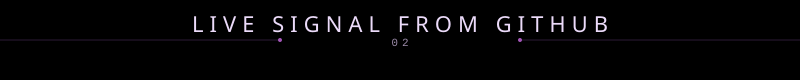

 

  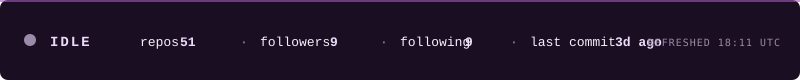

 

  

 

  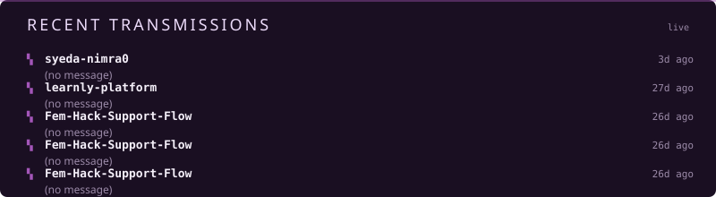

 

  <em>this signal refreshes hourly via GitHub Actions. not real-time — honest.</em>

 

 

<!-- ============================================================= -->
<!-- 03 — SPECIMENS COLLECTED                                      -->
<!-- ============================================================= -->

  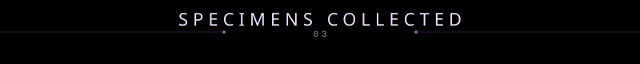

 

  <em>three client sites. three completely different visual languages. 
  that's the point.</em>

 

  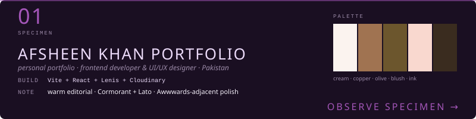

  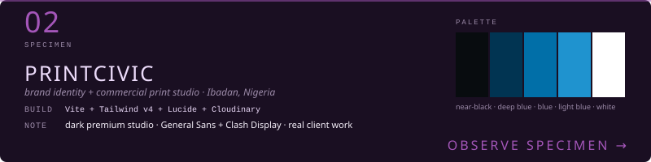

  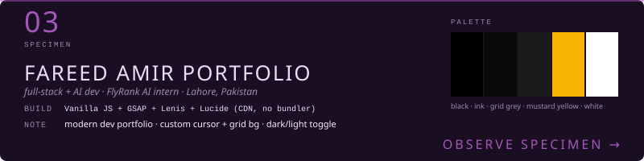

 

  <em>more specimens live in the studio.</em>

 

 

<!-- ============================================================= -->
<!-- 04 — CURRENTLY BUILDING                                       -->
<!-- ============================================================= -->

  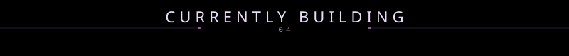

 

  <em>the cassette in the studio is playing —</em>

  <em>its label changes based on my most recent commit.</em>

  <em>look at the studio above, then check the live signal.</em> 
  <em>if my last commit was within 24h, the lamp is glowing purple.</em>

 

 

<!-- ============================================================= -->
<!-- 05 — THE TRAILER                                              -->
<!-- ============================================================= -->

  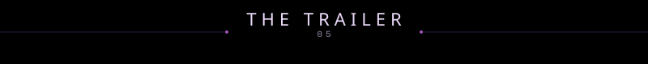

 

  

 

  <a href="https://syedanimra.site.je/"><strong>→ step inside the studio</strong></a>

  <em>https://syedanimra.site.je/</em>

 

 

<!-- ============================================================= -->
<!-- SOCIAL — plain text, no badges                                -->
<!-- ============================================================= -->

  <a href="https://github.com/syeda-nimra0/">github</a> &nbsp;·&nbsp;
  <a href="https://syedanimra.site.je/">portfolio</a> &nbsp;·&nbsp;
  <a href="https://www.linkedin.com/in/syeda-nimra-39a794349/">linkedin</a> &nbsp;·&nbsp;
  <a href="https://www.instagram.com/nimr._.exe/?hl=en">instagram</a> &nbsp;·&nbsp;
  <a href="mailto:nimrasyeda37@gmail.com">email</a>

 

  <em>same girl. bigger dreams.</em>

<!--
  End of README. The studio is quiet now.
  Live data refreshes hourly. See SETUP.md for maintenance.
-->
